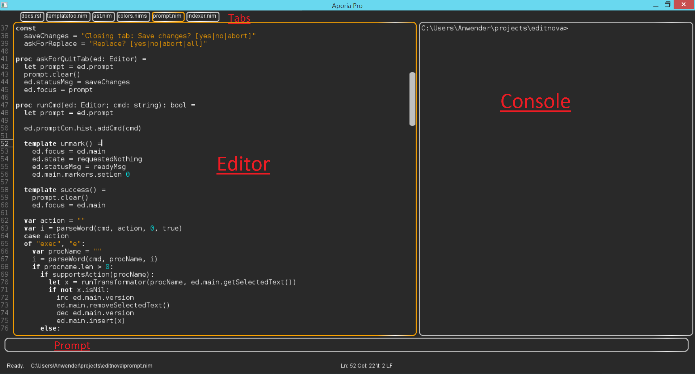

======================================================
        NimEdit User Manual
======================================================

  "Copying bad design is not good design."

NimEdit is a new editor / IDE written completely in Nim for Nim.
Its design is minimalistic and yet it is one of the most powerful
editors out there. Once you tried it for a while, you cannot go
back to other tools.

Concepts
========

NimEdit consists of an "editor", a "prompt", a list of "tabs" as
well as a "console":

You can right click on a tab to close it.

Shortcuts
=========

============   =========================================
CTRL+A         Select everything.
CTRL+B         Abort the currently running program (break). Note that
               CTRL+C always copies.
CTRL+C         Copy.
CTRL+V         Paste.
CTRL+X         Cut.
CTRL+E         Execute a Nim script. The currently selected Text is
               passed to the Nim script.
CTRL+F         Search a phrase in the input buffer. Use ``i`` after the search term
               to perform a case insensitive match, ``y`` for a style insensitive
               match, and ``b`` (or ``w``) to make the search care about word
               boundaries.
CTRL+H         Search and replace. The same options as for search are available.
CTRL+Z         Undo the previous edit operation.
CTRL+SHIFT+Z   Redo the previous edit operation. Undo the undo command.
CTRL+G         Goto line number.
CTRL+U         Update the syntax highlighting and remove search result markers.
CTRL+O         Open a file.
CTRL+S         Save the current file.
CTRL+N         Open a new buffer.
CTRL+Q         Close the current buffer.
CTRL+M         Open a minimap. The minimap contains
               a list of all declarations in the current Nim file.
CTRL+Space     Open auto-complete. If the caret is behind a dot, nimsuggest
               integration is
ESC            Switch between editor and prompt.
F1             Switch between editor and console.
F2             Nimsuggest integration: Goto definitions/usages.
F3             Goto next editing location. NimEdit automatically tracks the
               most recent locations that you edited. This feature replaces
               the common "bookmarks" feature found in other editors.
F5             Rerun the most recently executed nim
               command. Scriptable.
F6-F12         Scriptable.
============   =========================================

Commands
========

Many shortcuts like ``CTRL+E`` give the focus to the "prompt". This prompt replaces
many traditional UI elements with a command line interface. The syntax is
simply "command arg1 ... argN". Arguments are seperated by whitespace. You can also
use single quotes (``'term'``) or double quotes (``"term"``). The standard
escape sequences like ``\t`` are available within double quotes.
Every command is case insensitive.

``e``, ``exec``
  Run a Nim script. Select some text, press CTRL+e, type "doQuote" (without the quotes),
  press ENTER to get an idea of what this does.

``q``, ``quit``
  Quit without any questions asked of whether you want to save any unsaved changes!

``o``, ``open``
  Open a file. Note that tab completion works, so enjoy.

``s``, ``save``
  Save the current file. If you give an argument the file will be "saved as" instead.

``f``, ``find`` phrase search_options
  Find all occurances of a phrase in the current buffer.

``r``, ``replace`` phrase replacement search_options
  Replace all occurances of a phrase in the current buffer. You will be asked about
  every replacement.

``search_options`` is a string of single letters with no whitespace in between.

==============      ===========================================================
search_options      meaning
==============      ===========================================================
``w``               Respect word boundaries. Note: Searches for single letters
                    trigger this automatically. Use ``s`` to override this
                    behaviour.
``s``               Do not respect word boundaries.
``p``               Precise search, do not ignore case sensitivity.
``f``               Only search for the term in the active tab. Otherwise every
                    tab is searched.
``r``               Coming soon: Regular expression based search.
==============      ===========================================================

``lang``
  Set the programming language of the current buffer. Note that currently only a
  limited choice of programming languages is supported.

``LF``, ``CRLF``, ``CR``
  Set the line endings of the file to LF or CRLF or CR. When the buffer is saved
  the next time, all line endings will be converted.

``tab``, ``tabs``, ``tabsize``
  Set the tab size of the file to the specified number of spaces.

``config``
  Open the configuration file. Note that configuration changes are applied as
  soon as the config is saved. Try to play with the colors and see what happens.

``scripts``
  Open the NimScript support. Note that scripting changes are applied as
  soon as the config is saved.

``project`` [projectname]
  Set the project name that you are currently working on. The nimsuggest tool
  is called with this setting.

``sug start``
  Restart nimsuggest.

``sug stop``
  Stop nimsuggest.

``sug debug``
  Enable nimsuggest debug mode, passes ``--debug`` to nimsuggest.

``sug debug off``
  Disable nimsuggest debug mode.

NimScript integration
=====================

Type ``scripts`` into the prompt. Take a look at the implementation of what
happens if ``F6`` is pressed:

.. code-block:: Nim
  proc pressedF6*() =
    let w = getCurrentIdent(true)
    insert("<$1></$1>" % w)
    setCaret(getCaret() - w.len - "</>".len)

The API that NimEdit exposes is documented here: `<editor.html>`_
